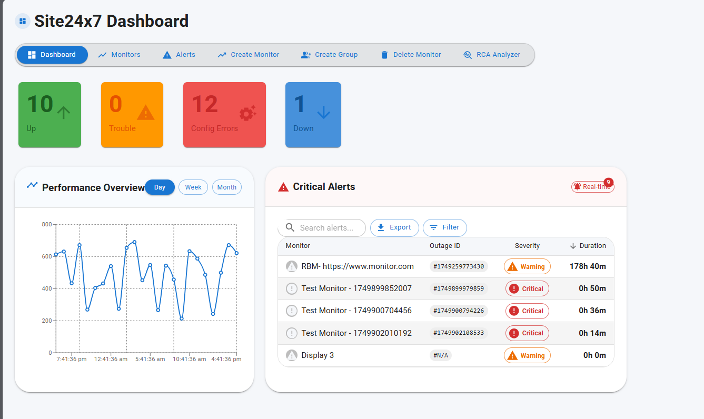

# Site24x7 React Frontend – Monitor Dashboard

This is the React frontend for the Site24x7 Monitoring Assistant. It connects with the Spring Boot backend to allow users to create monitors, organize them into monitor groups, and view their current statuses and alarm history.

---

##  Features

-  View all monitors fetched from Site24x7
-  Check real-time status summaries in `StatusSummary.js`
-  Create new monitor groups with custom settings
-  Create website monitors with desired configurations
-  View alarm history in a clear tabular format
-  Secured with CORS to interact with the Spring Boot backend

---

## Tech Stack

- React (Create React App)
- Axios for API calls
- Bootstrap (or your styling lib)
- Integrated with Spring Boot + MySQL backend

---

## To Run Locally

Make sure the backend is running on port `8080` first. Then run:

```bash
npm install
npm start
```

## 📸 Dashboard Preview

This image shows the live dashboard in action with a monitor chart, alert status, and navigation.


